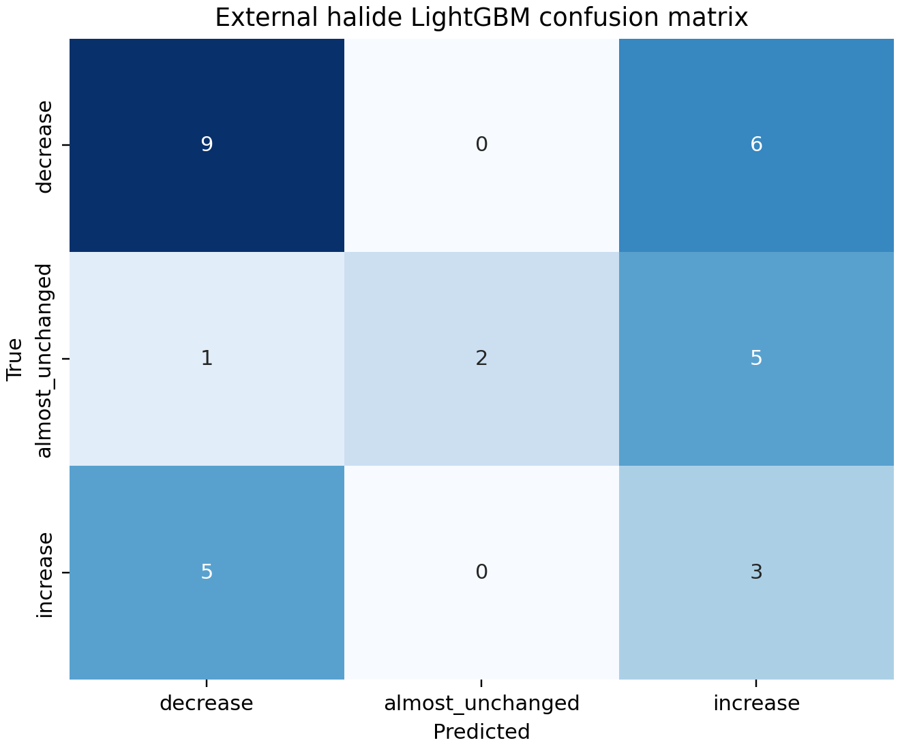
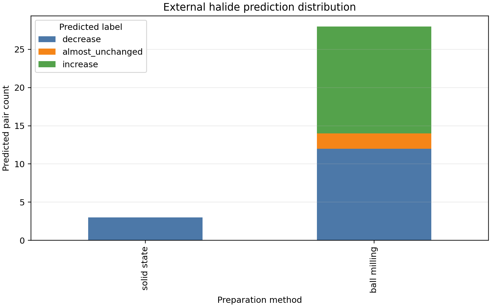

# Halide 外部数据 LightGBM 趋势评估

## 数据处理

- 输入记录：22
- 可由当前组成描述符严格表示：11
- 因含 wt% 添加剂复合写法而排除：11
- 只在相同制备方法内配对，不跨球磨/固相配对
- 趋势标签沿用训练规则：电导率绝对变化严格超过 1e-4 S/cm，或倍数严格超过 100
- family 输入为 halides

## 主要结果

| 子集 | pair 数 | Accuracy | Balanced accuracy | Macro-F1 | 制备组等权 Macro-F1 | 制备组等权严重反转率 |
|---|---:|---:|---:|---:|---:|---:|
| 全部严格可表示 pair | 31 | 0.4516 | 0.4083 | 0.4242 | 0.5076 | 0.1964 |
| A/B 化学式均未见于训练集 | 16 | 0.4375 | 0.4206 | 0.3704 | 0.4288 | 0.1644 |

全部 31 对中最多的真实类别为 decrease，占 15/31；恒预测 decrease 的 accuracy 为 0.4839、balanced accuracy 为 0.3333、Macro-F1 为 0.2174。LightGBM 的总体 accuracy 略低于该多数类基线，但 balanced accuracy 和 Macro-F1 更高，说明模型覆盖了更多类别，整体仍只属于弱到中等水平。

### 按制备组

| 制备组 | pair 数 | Accuracy | Balanced accuracy | Macro-F1 | 严重反转率 |
|---|---:|---:|---:|---:|---:|
| 球磨 | 28 | 0.3929 | 0.3750 | 0.3909 | 0.3929 |
| 固相 | 3 | 1.0000 | 1.0000 | 0.3333 | 0.0000 |

固相组只有 3 对且真实标签全部为 decrease，3/3 命中不能证明三分类能力。由于制备组等权会让这个很小的组与 28 对球磨组具有相同总权重，制备组等权 Macro-F1 0.5076 被明显抬高；本外部集应优先参考普通 Macro-F1 0.4242 和球磨组结果。

## 图形

## 注意事项

1. 该表只有两个制备组，pair 之间共享原始化合物，因此 31 个 pair 不是 31 个完全独立样本。
2. 含 ZrCl4 wt% 添加剂的记录未进入主评价，因为当前 27 个组成特征无法表示第二相添加量。
3. 输出中的模型概率尚未校准，只应作为相对排序分数。
4. seen_in_train_formula 与 seen_in_validation_formula 列用于审计数据重叠；严格外推应优先看 A/B 均未在训练集中出现的子集。
5. A/B 均未见于训练集的 16 对没有真实 increase 标签，因此该子集不能评价全新化学式上的 increase 识别能力。
