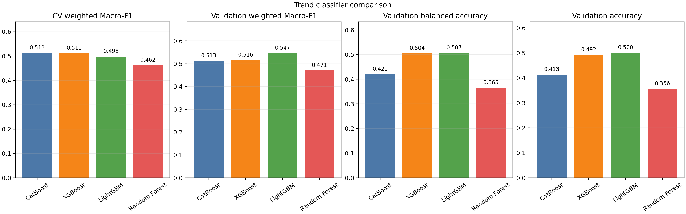
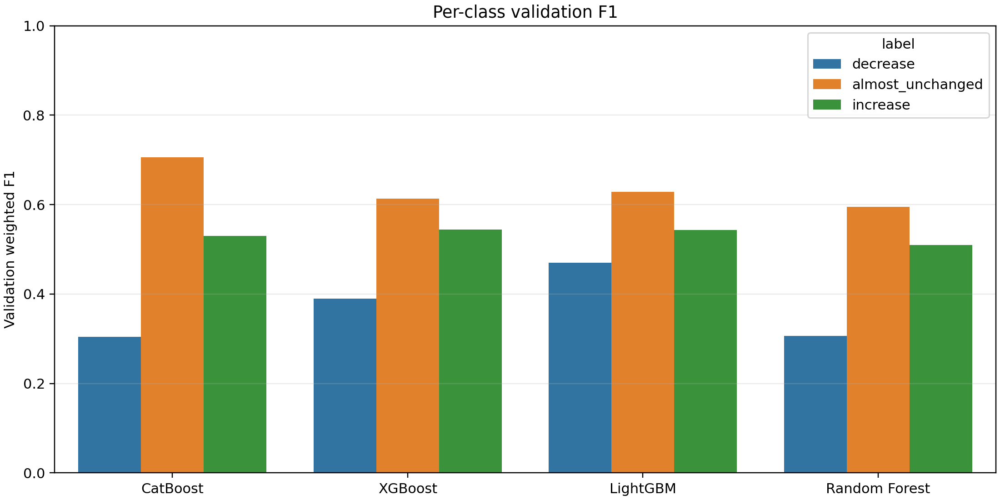
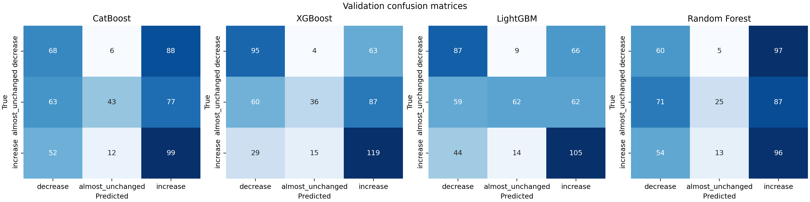
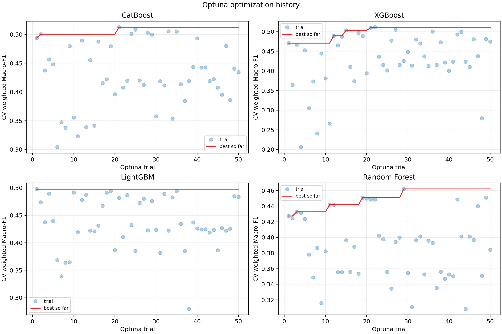

# 趋势三分类模型报告

## 结论

本次正式运行比较了 LightGBM、CatBoost、XGBoost 和 Random Forest。模型选择依据是训练集内部按 DOI 分组的 5 折交叉验证加权 Macro-F1，固定验证集只用于最终评估。

- 按 DOI 分组 CV 选择的模型：**CatBoost**
- 固定验证集 weighted Macro-F1 最高的模型：**LightGBM**
- 这两个结果不完全一致，说明固定验证集的文献组成与训练集 CV 分布存在差异；不应仅凭验证集一次结果重新调参。

## 数据与训练设置

- 原始训练 pair：2031；交换增强后：4062
- 固定验证 pair：508
- 训练 DOI/验证 DOI：95/29
- 输入：27 个数值特征 + family_normalized 类别特征，共 28 个模型输入
- 目标：decrease、almost_unchanged、increase
- 训练权重：pair_weight_group_equal
- 交换增强：signed delta 取反，mean/magnitude 不变，增大与减少标签互换；正反方向各使用原权重的 0.5
- 验证预测：正向和反向对齐后的类别概率取平均
- Optuna：每个模型 50 trials；目标为 DOI 分组 CV 的平均 weighted Macro-F1

## 模型效果

| 模型 | CV weighted Macro-F1 | 验证 weighted Macro-F1 | 验证 balanced accuracy | 验证 accuracy | 验证 DOI Macro-F1 | 增大/减少反向率 |
|---|---:|---:|---:|---:|---:|---:|
| CatBoost | 0.5126 | 0.5130 | 0.4207 | 0.4134 | 0.2554 | 0.2326 |
| XGBoost | 0.5113 | 0.5158 | 0.5044 | 0.4921 | 0.2524 | 0.1963 |
| LightGBM | 0.4980 | 0.5471 | 0.5067 | 0.5000 | 0.2532 | 0.1740 |
| Random Forest | 0.4620 | 0.4707 | 0.3653 | 0.3563 | 0.2303 | 0.2266 |

### 验证集各类别 F1

| 模型 | decrease | almost_unchanged | increase |
|---|---:|---:|---:|
| CatBoost | 0.3041 | 0.7055 | 0.5295 |
| XGBoost | 0.3894 | 0.6133 | 0.5446 |
| LightGBM | 0.4696 | 0.6286 | 0.5430 |
| Random Forest | 0.3067 | 0.5954 | 0.5101 |

指标说明：

- weighted Macro-F1 使用 pair 权重，避免 pair 数量多的 group 主导结果。
- DOI Macro-F1 是先对每个 DOI 等权计算，再取平均，反映跨文献泛化。
- 增大/减少反向率表示真实 increase 被预测为 decrease 或反之。

### LightGBM 简单基线与子集检查

验证集样本按行的多数类基线 accuracy 为 0.360，随机三分类的期望 accuracy 约为 0.333；LightGBM accuracy 为 0.500，说明模型确实学到了可重复的趋势信号，但距离稳定的高精度模型仍有明显差距。

| 子集 | pair 数 | DOI 数 | accuracy | balanced accuracy | 普通 Macro-F1 |
|---|---:|---:|---:|---:|---:|
| 指定系列 DOI | 136 | 1 | 0.7500 | 0.5222 | 0.5034 |
| 其他验证 DOI | 372 | 28 | 0.4086 | 0.4019 | 0.3961 |

指定系列所在 DOI 的逐行 accuracy 较高，但它只代表一篇文献，不能替代跨 DOI 泛化评估。

## 图形

## 解读与限制

1. CatBoost 的 DOI-CV 分数最高，但固定验证集上的 weighted Macro-F1 由 LightGBM 最高；应把 CatBoost 作为当前 CV 主模型，同时保留 LightGBM 作为验证集表现对照。
2. XGBoost 与 CatBoost 的 CV 很接近，二者可以作为后续概率集成候选。
3. Random Forest 明显落后，说明当前 27 个差分/均值/幅度特征更适合 boosting 模型。
4. 验证集只包含 29 个 DOI，且指定 Li-Y-Zr-Cl 系列所在 DOI 被整体锁定；结果适合固定基准比较，不代表所有新文献分布上的最终性能。
5. 当前任务是趋势分类，未训练 delta-log10-conductivity 回归，因此不能从本报告直接得到变化幅度预测。

## 输出

- model_comparison.csv：四模型汇总
- 每个模型的 validation_metrics.json：完整指标和混淆矩阵
- 每个模型的 validation_predictions.csv：逐 pair 预测概率
- 每个模型的 best_params.json：Optuna 最优参数
- 每个模型的 optuna.db、optuna_trials.csv：可复查或续跑的调参记录
- 每个模型的 model.joblib：最终模型和预处理器
